# Fat-Tree Network Simulator

## 🧩 Overview

This project is the submission for HW in the course <bold>Networks for Data Centers and AI </bold>.

The project is aimed to simulate and visualize the behavior of a Fat-Tree network topology under various scenarios.
For this purpose, I implemented a fully functional network-flow simulator.
The simulator is based on the design pattern DES: Discrete Event Simulator.  This design allows to model the network components as independent entities that interact via events, while using deterministic timing.

The goal architecture implemented is of "Fat Tree Network Topology" by *Al-Fares et al., SIGCOMM 2008*.
The simulator models packet transmission, basic routing, and failure scenarios in a scalable data-center topology.


**Objectives:**
- Understand and implement a hierarchical Fat-Tree topology.
- Simulate packet delivery between hosts across pods.
- Evaluate network behavior under **normal** and **disruptive** conditions
- Observe routing, load balancing (ECMP), and fault recovery.

## ⚙️ Implementation Approach
- **Language:** Python 3.9+
- **Framework:** My own event-driven simulator
- **Alternatives:** Using external simulation libraries such as mininet. Eventually I choose to implement my own for the learning process.
- **SW approach**: Fully Object-Oriented modeling for the system, where each object acts similarly to its real-world behavior.
- **Visualization**:  Added externally to the real world simulation, using matplotlib and networkx for graph visualization.
- **logging**: Full logger is available for debug and tracking. Log is saved to file `simulation.log`.
- **Other scenarios**: The simulator is designed to be extensible to other topologies and scenarios, such as HSH (host-switch-hos) and a tree ('simple star').

### 💡 AI Usage
**I developed and coded the project by myself, yet was assisted by Gen AI tools as follows:**  
- Design alternatives and decision: choosing DSE (over usage of mininet) consulted by ChatGPT5      
- Python ongoing hints features exploration: ChatGPT5  
- Typo corrections finding: Github Copilot (GPT-5 mini)  
- Readme.md: hyper-text syntax, common readme structuring: ChatGPT5, Copilot  (GPT-5 mini)
- Visualizations and plots: pakages selection, implementation hints and examples: github Copilot (GPT-5 mini, Claude Sonnet 3.5)

ChatGPT doumentation will be published as part of final submission.

### 🧩 Architecture main components
| Real life Component  | Responsibility                                                                                                                                                                                          |
|----------------------|---------------------------------------------------------------------------------------------------------------------------------------------------------------------------------------------------------|
| `Host`               | Generates and receives packets;                                                                                                                                                                         |
| `Switch`             | Contains multple ports. Maintains forwarding tables by subnets; <br/>handles packet forwarding and ECMP when the candidate ports have same weight, use reducing alternative trials for looping messages |
| `Link`               | Connects two nodes; simulates latency, bandwidth, and randomal failures. transfer the event from the sending entitiy to the receiving                                                                   |

| Pure SW Component     | Responsibility                                                                                           |
|-----------------------|----------------------------------------------------------------------------------------------------------|
| `Node`                | Base class for an actor that may receive and handle events                                               |
| `NetworkNode`         | A Node that can receive netwok packets (Host, Switch..). implementes the actual routing.                 |
| `Scheduler`           | Alias for the discrete event manager. Handles scheduled-tasks and execute them on the right time         |
| `Message` / `Packet`  | Data unit that is sent between components. In this implementation also track its rout, timing etc.       |
| `SimulatorCreator`    | Base class for creating instances of simulation (e.g. Fat Tree). Takes car also on results and summaries |

### 🕸️ Design Highlights: Network Routing
- Each port is set with a subnet
- Routing is done to the "narrowest" subnet match
- ECMP implemented by random choice among equal-cost paths
- Loop is tracked: each port remembers the packets that went through it, and avoid re-sending them
- If a packet is found looped, it is marked as lost and a trial starts to send it to different ports, even one that don't match the subnet. This solves the "non trivial core" path, in case an aggregation-edge link is down.
- If a packet has no routing (either by subnet or by lost-procedure), it is marked as dropped and gets out of the game.
- Each packet holds information about the creation time and number of hops. If TTL or number of hops goes beyond a threshold (hard coded) then the message is dropped.

### 🕸️ Design Highlights: Experiment
- Each host sends n times packets to randomly chosen n other hosts
- The time interval between each host's packet is the estimated time to send the packet on a link
- Latest version shows how unbalanced was the run by showing a histogram of number of hosts per each received number
- The system ran up to k=48 with incereasing pycharm memory limits to 8GB. 
- Verbose and Visualize options available but practically can work up to k=16
 
### 📦 Design Highlights: SW Architecture
- Packages split over functionalities
- Object-oriented, real-time simulating implementation.
- Event queue ensures deterministic simulation order.
- Fat Tree: Configurable `k` parameter (controls pods, switch count, and hosts).
- Forwarding tables auto-generated per Al-Fares conventions (TBD)
- Failure injection for testing robustness (TBD)
### update before final commit

## Project structure

```
networks_for_datacener_HW1/
├── `README.md`
├── `main.py`
├── `requirements.txt` (TBD)
├── `des/`
│   ├── `__init__.py`
│   ├── `des.py`
│   └── `priority_queue.py`
├── `network_simulation/`
│   ├── `__init__.py`
│   ├── `experiment_visualizer.py`
│   ├── `visualizer.py`
│   ├── `simulator_creator.py`
│   ├── `host.py`
│   ├── `switch.py`
│   ├── `link.py`
│   ├── `message.py`
│   ├── `network_node.py`
│   ├── `node.py`
│   ├── `ip.py`
│   └── (internal helpers)
├── `scenarios/`
│   ├── `__init__.py`
│   ├── `fat_tree_topo_creator.py`
│   ├── `hsh_creator.py`
│   └── `simple_star_creator.py`
├── `statistics/`
│   ├── `__init__.py`
│   └── (stats helpers)
├── `results/` (generated output)
│   └── `experiments/`
│       ├── `exp_k_4_links_load.png`
│       └── `...`
└── `unit_tests/`
    ├── `des_tests/`
    └── `ip_tests/`
```

## ▶️ How to Run

### 1. Clone the repository
```bash
    git clone https://github.com/AlonZeltser/networks_for_datacener_HW1.git
```

### 2. Install dependencies

```bash
pip install -r requirements.txt
```

### 3. Run baseline scenario

Parameters list:

```bash
python main.py --help

usage: main.py [-h] [-t T] [-k K [K ...]] [-visualize]
               [-link-failure LINK_FAILURE [LINK_FAILURE ...]] [-verbose]

Network simulator runner

optional arguments:
  -h, --help            show this help message and exit
  -t T                  Type of topology: fat-tree, hsh (simplest, for demo),
                        simple-star (simple tree with 2 levels, for demo and
                        debugging)
  -k K [K ...]          (fat-tree only) list of number of ports per switch
                        (must be even)
  -visualize            Enable topology on screen visualization (single
                        boolean flag). If not set, visualizations are still
                        saved to files.
  -link-failure LINK_FAILURE [LINK_FAILURE ...]
                        list of probability of links to fail in each test.
                        Fraction (0-100) of links to fail
  -verbose              Enable verbose logging output to console

```
**example 1:** running fat-tree architecture with k=4, 6, 8, on-screen visualization, link failures of 0%, 5%, 10%:
```bash
python main.py -t fat-tree -k 4 6 8 -v -link-failure 0 5 10
```

**example 2:** running simple tree architecture with no on-screen visualization, link failures of 20%:
```bash
python main.py -t simple-star -link-failure 20
```

### 4. View results
- During the run, the simulator will output logs to the console and to `simulation.log`.
- After completion, results summaries and visualizations will be saved in the `results/` directory.

## 🧪 5. Tests and Scenarios
- There were many scenarios tested during the development phase.
- For network high-load performance analysis, I focused on realistic Fat-Tree scenarios.
- The k values tested are 12, 24, 48.
- Link failure rates tested: 0%, 1%, 5%, 10%. The higher values are for stress testing and finding trends, since less realistic.-
- The number of messages sent from each host to another is set to 5.
- The results are saved under results_from_demo_run/fat_tree_performance_experiments/


## 📊 6. Results Summary

### General Observations
- The simulator successfully modeled packet delivery across the Fat-Tree topology.
- Under normal conditions (0% link failure), nearly all packets were delivered successfully with minimal latency.
- Since the target-server selection is random, some hosts received more packets than others, as shown in the histogram. 
I chose that to simulate real world uneven loads.
- Below are the histograms showing the distribution of received-packet counts per host for runs with `link-failure = 0.0`:
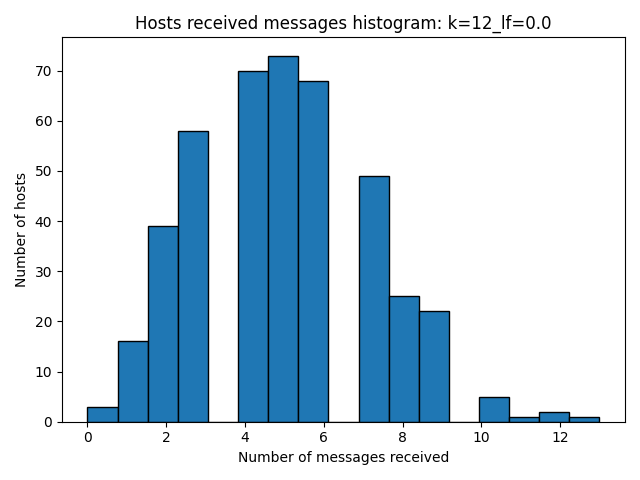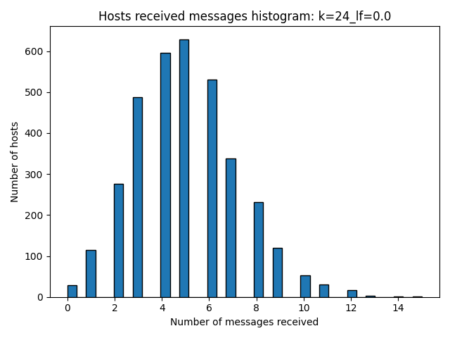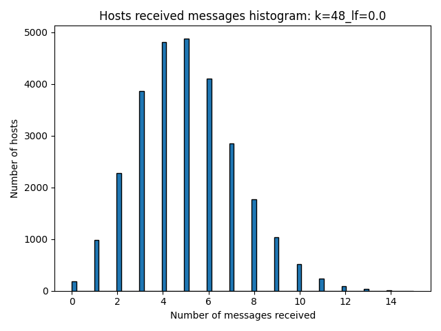

### Performance when no link failures occur 
- With no link failures, the delivery rate was nearly 100%.
- The paths lengths as were about 6: 3 steps up to a flow dependent core switch (since ECMP is used by hashing the message),
and 3 steps down using a deterministic subnet mapping (in real life: static routing table for core to aggregation and aggregation to edge, and  L2 ARP for edge to destination host)
- Below is the performance summary for k=12, 24, 48 with 0% link failure:
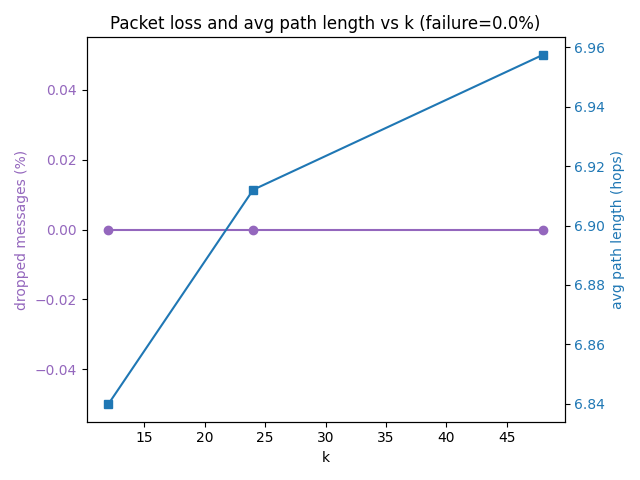

### Link Failure Impact 
- As link failure rates increased, the delivery performance degraded somewhat. Comparing 12, 24, and 48, we can see that the larger the network, the smaller the impact (to some extent).
- The simulator's ECMP routing and loop avoidance mechanisms helped mitigate the impact of failures, but some packets were inevitably dropped when no rout was available at the edge-host level.
- Below are performance summaries for k=12, 24, 48 with 1%, 5%, and 10% link failure:  
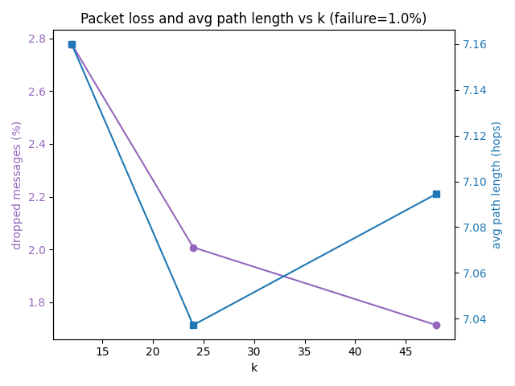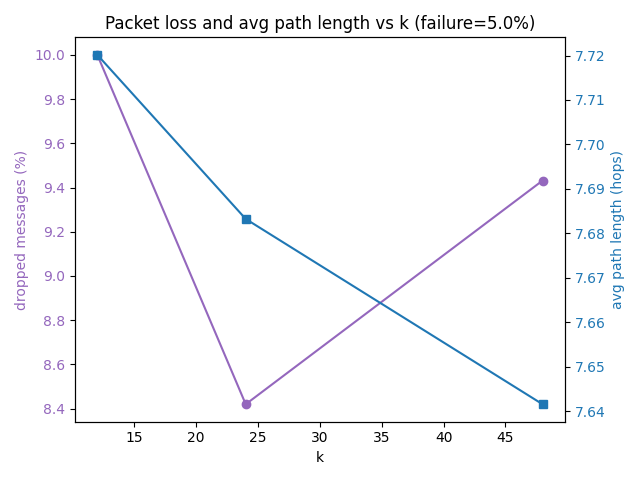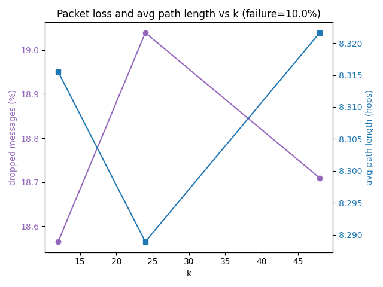
- If we check the dropped packet and the "lost but recovered" packets, we can see that as the link failure rate increases very slowly, which indicates that the Fat-Tree network is fairly resilient due to its multiple paths, ECMP and my loop avoidance mechanism.
A reasonable failure rate would be 1%-5%, which shows that the system overall will slow (retransmitting) but won't collapse.
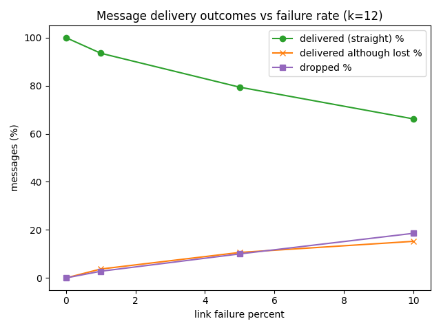  
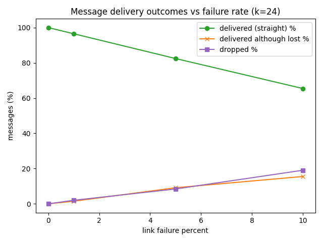  
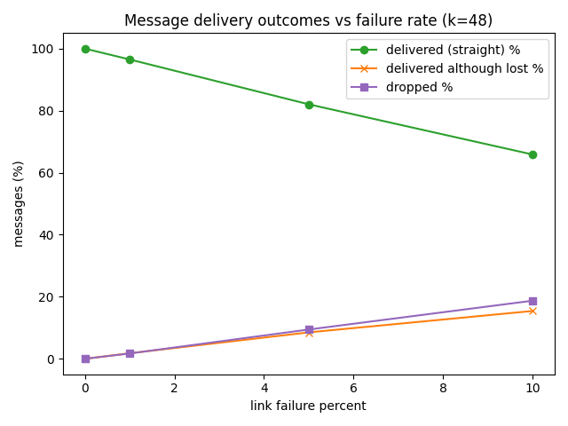
- Bandwidth and TPT: on this metric, the system shows mild degradation as the link failure rate increases, since more packets are dropped or made much larger path. A longer path would  occur also in dynamic routing based system.   
Although some extreme long paths created, the overall throughput (average length) decresed insignificantly. This indicates that the Fat-Tree topology is effective in maintaining performance, although some cases (applications) will still suffer. 
Below we can see the throughput and bandwidth for k=12, 24, 48 with varying link failure rates:  
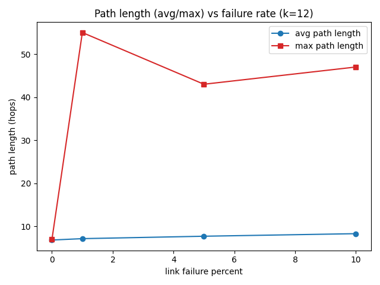  
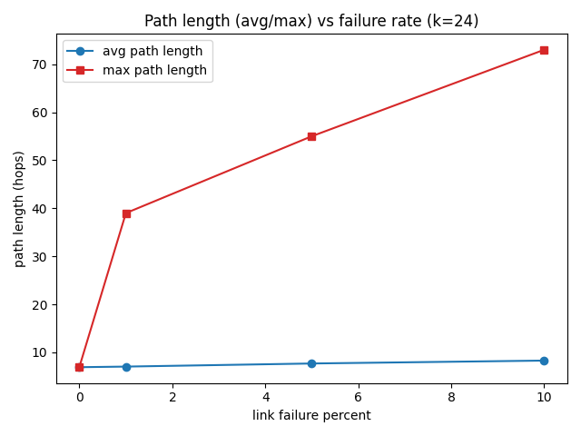  
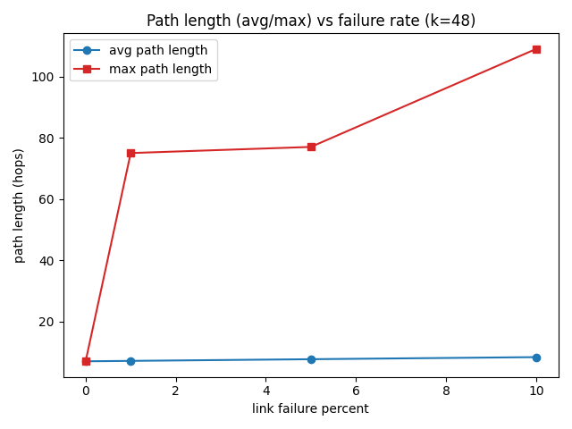
- Inspecting the link behavior, we can see that the base case was overall not very loaded. This can be a result of the scheduling and the uneven distribution of destinations.
As the link failure rate increases, the remaining links became more loaded, as expected.
Below are the link load distributions for k=12, 24, 48 with varying link failure rates:  
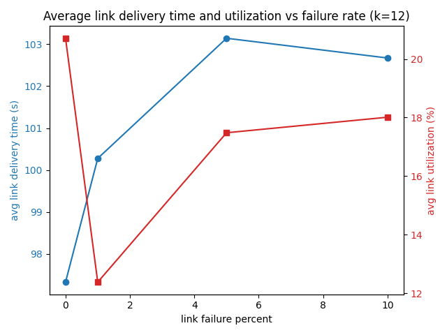  
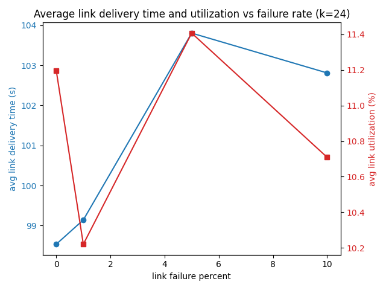  
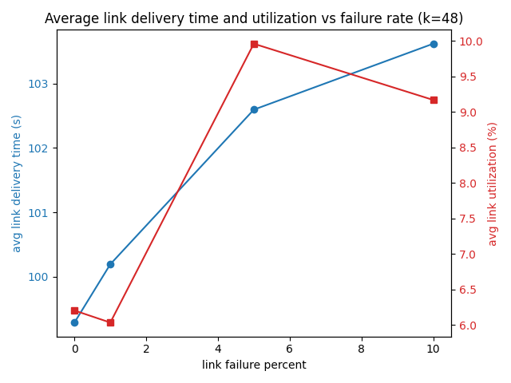

## 📝 Conclusions
- The Fat-Tree network simulator effectively models packet delivery in a hierarchical data-center topology.
- The simulator demonstrates high delivery rates under normal conditions and reasonable resilience to link failures.
- I would inspect also higher load scenarios, as the overall utilization on the links was not high, and also check the ideal-but-not-realistic case of single source-destination constant pairs.


## 📚 References
- M. Al-Fares, A. Loukissas, A. Vahdat,  
  *A Scalable, Commodity Data Center Network Architecture*, SIGCOMM 2008.  
- [Wikipedia: Fat Tree network topology](https://en.wikipedia.org/wiki/Fat_tree)
- [Wikipedia: Discrete event simulation](https://en.wikipedia.org/wiki/Discrete-event_simulation)
- [Mininet](http://mininet.org/)
- [Wikipedia: subnets and subnetting](https://en.wikipedia.org/wiki/Subnet)
- [Wikipedia: ECMP](https://en.wikipedia.org/wiki/Equal-cost_multi-path_routing)
- [chatGPT-5]: attached documentation of usage

## ✍️ Author
**Alon Zeltser**
Date: 12.11.2025
